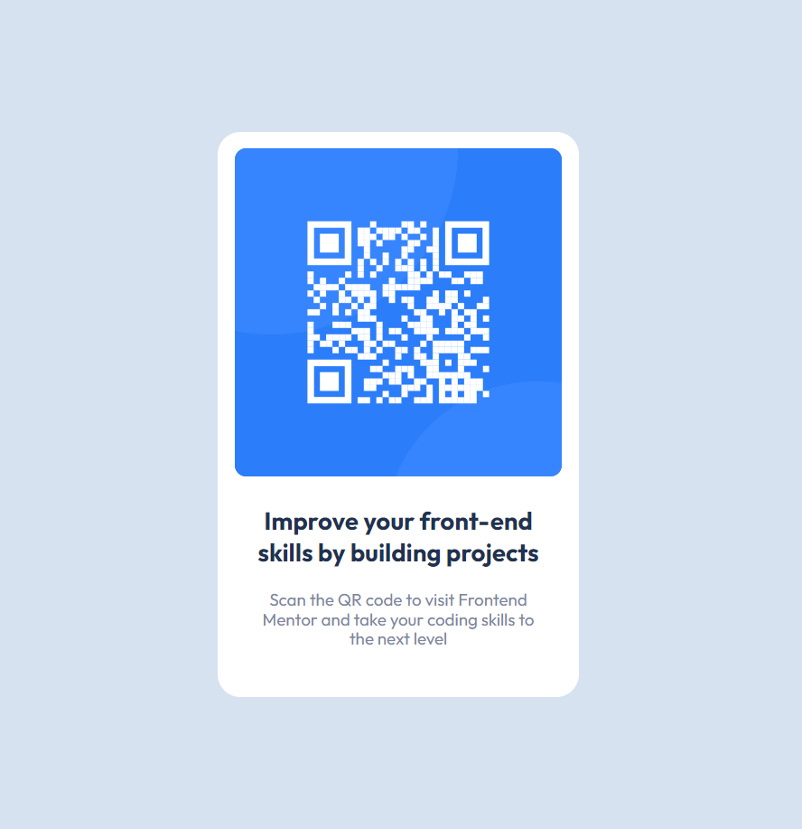

# Frontend Mentor - QR code component solution

This is a solution to the [QR code component challenge on Frontend Mentor](https://www.frontendmentor.io/challenges/qr-code-component-iux_sIO_H). Frontend Mentor challenges help you improve your coding skills by building realistic projects. 

## Table of contents

- [Overview](#overview)
  - [Screenshot](#screenshot)
  - [Links](#links)
- [My process](#my-process)
  - [Built with](#built-with)
  - [What I learned](#what-i-learned)
  - [Useful resources](#useful-resources)
- [Author](#author)

## Overview

For the QR code component challenge on Frontend Mentor I created a page for mobile and desktop sizes with HTML and CSS.

### Screenshot

### Links

- Live Site URL: [here](https://shcraco-qr-code-challenge.netlify.app)

## My process

### Built with

- Semantic HTML5 markup
- CSS
- Flexbox

### What I learned

In this challenge I learned to develop a pixel perfect layout with HTML and CSS. Created custom CSS properties for design colors, which is good for clear code structure.

### Useful resources

- [Using flexbox](https://css-tricks.com/snippets/css/a-guide-to-flexbox/) - This helped me to recollect the basics of Flexbox model.
- [CSS variables](https://developer.mozilla.org/en-US/docs/Web/CSS/--*) - Creating CSS variables.

## Author

- GitHub - [Tetiana B.](https://github.com/Shcracoziabra)
- Frontend Mentor - [@Shcracoziabra](https://www.frontendmentor.io/profile/Shcracoziabra)
